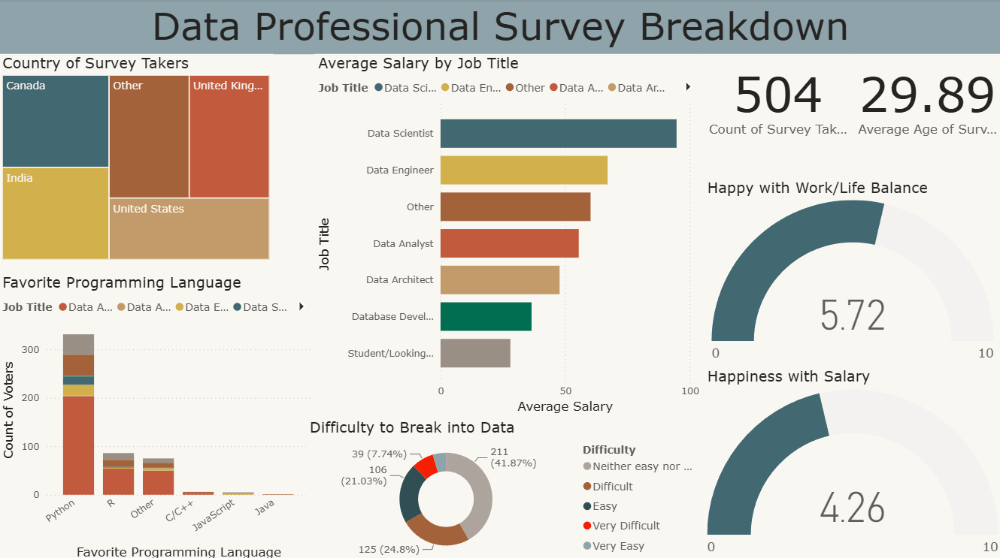

# Data Professional Survey Breakdown

**A Power BI dashboard project analyzing survey responses from data professionals across different countries, roles, salaries, programming languages, and career experiences.**

---

## Overview

This project explores survey data from data professionals and presents the results through an interactive Power BI dashboard.

The analysis focuses on:

- Salary differences across data roles
- Geographic distribution of survey participants
- Favorite programming languages
- Work-life balance satisfaction
- Salary satisfaction
- Difficulty of entering the data field
- Demographic patterns among respondents

**Tech Stack:**  
Power BI · Power Query · DAX · Excel · Data Modeling

---

## Dashboard Preview



---

## Dataset

The source survey dataset is available in:

[`data/data_professional_survey.xlsx`](data/data_professional_survey.xlsx)

The dataset contains survey responses related to:

- Country
- Job title
- Salary
- Age
- Programming language preference
- Work-life balance
- Salary satisfaction
- Career entry difficulty

---

## Power BI Analysis

The dataset was cleaned, transformed, and modeled in Power BI before being used to build the final dashboard.

The dashboard includes:

- Survey participant count
- Average respondent age
- Average salary by job title
- Country distribution
- Favorite programming language
- Work-life balance score
- Salary satisfaction score
- Difficulty of entering the data profession

The visual layout allows users to compare different aspects of the data profession within a single dashboard.

**Power BI File**

[`data_professional_survey_dashboard.pbix`](powerbi/data_professional_survey_dashboard.pbix)

---

## Key Insights Available

The dashboard supports comparisons such as:

- Which data roles have higher average salaries
- Which programming languages are most commonly preferred
- How respondents rate their work-life balance
- How satisfied respondents are with their salaries
- How difficult professionals found it to enter the data field
- How survey participants are distributed across countries

---

## Repository Structure

```text
data-professional-survey-analysis/
│
├── data/
│   └── data_professional_survey.xlsx
│
├── powerbi/
│   └── data_professional_survey_dashboard.pbix
│
├── images/
│   └── data_professional_survey_dashboard.png
│
└── README.md
```

---

## Summary

This project demonstrates an end-to-end Power BI workflow from raw survey data to an interactive analytical dashboard.

**Survey Data → Data Cleaning → Data Modeling → Power BI Dashboard**
